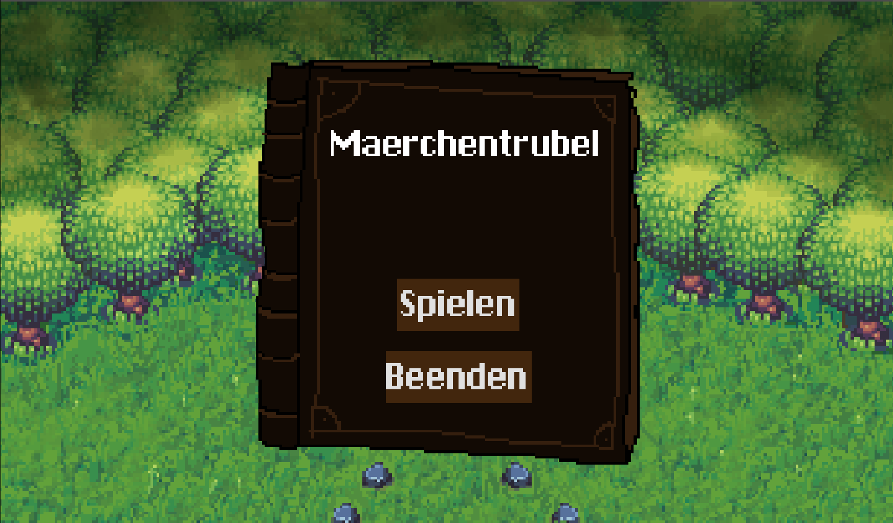
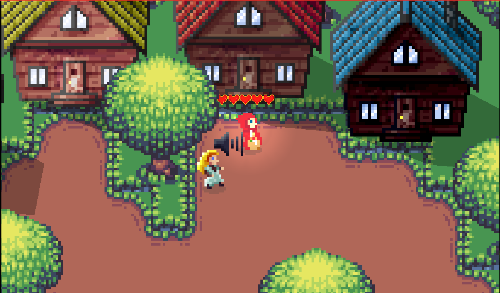
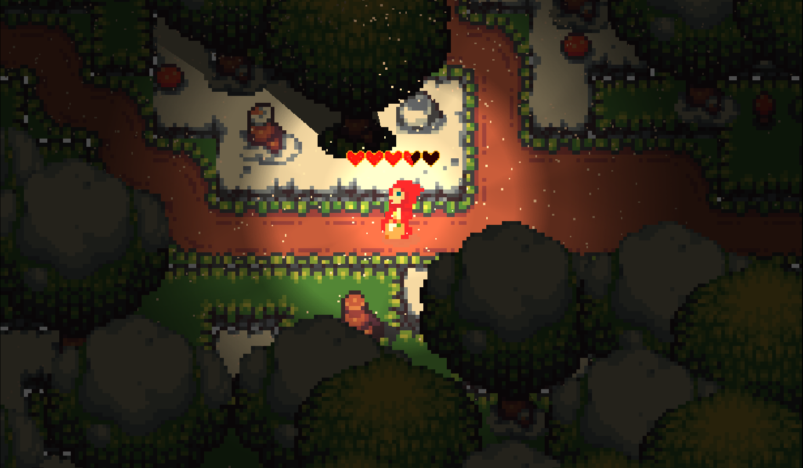

# Märchentrubel

Ein Spiel in dem man mehrere Märchen nachspielt und so deren Geschichte in einem Buch neu schreibt.
Erstellt für den [NØRD Jam 2021](https://diznb.de/noerdjam-2021/). 

## [Hier online spielen!](https://noerd2021.brutenis.net/)

## Artwork

Alles ist von uns erstellt, außer:

* Pixel-art sprites: [The Field of the Floating Islands](https://opengameart.org/content/the-field-of-the-floating-islands) von Buch (Lizenz: CC0)
* Schrift: [ChiKareGo2](http://www.pentacom.jp/pentacom/bitfontmaker2/gallery/?id=3780) von Giles Booth (Lizenz: Creative Commons Attribution)
* Light sprite: [light.png](https://raw.githubusercontent.com/godotengine/godot-demo-projects/master/2d/lights_and_shadows/light.png) von Godot (Lizenz: MIT)

